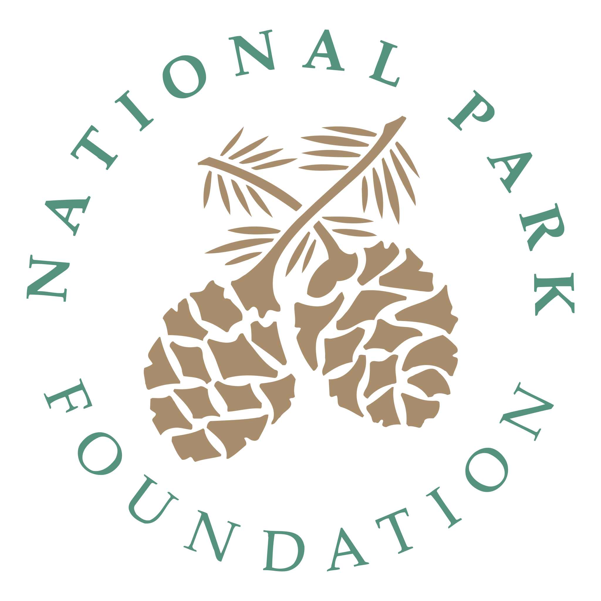

<!-- PROJECT LOGO -->
 

  
  
  <h3 align="center">National Park Finder</h3>

  

    Find your next nature travel destination.
     
    <a href="https://tnf8q.csb.app/"> Link to demo <a/>
      
  

  

<!-- TABLE OF CONTENTS -->
## Table of Contents

* [About the Project](#about-the-project)
  * [Built With](#built-with)
* [Roadmap](#roadmap)
* [Contact](#contact)

<!-- ABOUT THE PROJECT -->
## About The Project

  

With the goal of helping people find national parks to visit, national park finder
helpss to get information on building national parks across America.

### Built With

*  React

<!-- ROADMAP -->
## Roadmap

See the [open issues](https://github.com/github_username/repo/issues) for a list of proposed features (and known issues).

<!-- CONTACT -->
## Contact

Matthew Demoy - Matthew_Demoy@student.uml.edu

Project Link: https://github.com/Matthew-Demoy/NationalParkHelper

<!-- MARKDOWN LINKS & IMAGES -->
<!-- https://www.markdownguide.org/basic-syntax/#reference-style-links -->
[contributors-shield]: https://img.shields.io/github/contributors/othneildrew/Best-README-Template.svg?style=flat-square
[contributors-url]: https://github.com/othneildrew/Best-README-Template/graphs/contributors
[forks-shield]: https://img.shields.io/github/forks/othneildrew/Best-README-Template.svg?style=flat-square
[forks-url]: https://github.com/othneildrew/Best-README-Template/network/members
[stars-shield]: https://img.shields.io/github/stars/othneildrew/Best-README-Template.svg?style=flat-square
[stars-url]: https://github.com/othneildrew/Best-README-Template/stargazers
[issues-shield]: https://img.shields.io/github/issues/othneildrew/Best-README-Template.svg?style=flat-square
[issues-url]: https://github.com/othneildrew/Best-README-Template/issues
[license-shield]: https://img.shields.io/github/license/othneildrew/Best-README-Template.svg?style=flat-square
[license-url]: https://github.com/othneildrew/Best-README-Template/blob/master/LICENSE.txt
[linkedin-shield]: https://img.shields.io/badge/-LinkedIn-black.svg?style=flat-square&logo=linkedin&colorB=555
[linkedin-url]: https://www.linkedin.com/in/matthew-demoy-9ba2ab123/
[product-screenshot]: assets/screens/JournalScreen.png
